# Amazon Aurora Global Database w/ AWS CDK

This is an example implementation of AWS CDK to create an Amazon Aurora Global Database in the Tokyo region and the Osaka region.




## How to deploy
```sh
cdk deploy --all --require-approval never
```

## How to failover

```sh
# Get Cluster Identifier
export GLOBAL_CLUSTER_IDENTIFIER=$(aws cloudformation describe-stacks --stack-name TokyoAuroraStack --output text --query 'Stacks[0].Outputs[?OutputKey == `GlobalClusterIdentifier`].OutputValue' --region ap-northeast-1)

export PRIMARY_CLUSTER_IDENTIFIER=$(aws cloudformation describe-stacks --stack-name TokyoAuroraStack --output text --query 'Stacks[0].Outputs[?OutputKey == `ClusterIdentifier`].OutputValue' --region ap-northeast-1)

export SECONDARY_CLUSTER_IDENTIFIER=$(aws cloudformation describe-stacks --stack-name OsakaAuroraStack --output text --query 'Stacks[0].Outputs[?OutputKey == `ClusterIdentifier`].OutputValue' --region ap-northeast-3)


# Switchover
aws rds switchover-global-cluster --global-cluster-identifier $GLOBAL_CLUSTER_IDENTIFIER --target-db-cluster-identifier $SECONDARY_CLUSTER_IDENTIFIER

# Failover
aws rds failover-global-cluster --global-cluster-identifier $GLOBAL_CLUSTER_IDENTIFIER --target-db-cluster-identifier $SECONDARY_CLUSTER_IDENTIFIER

```